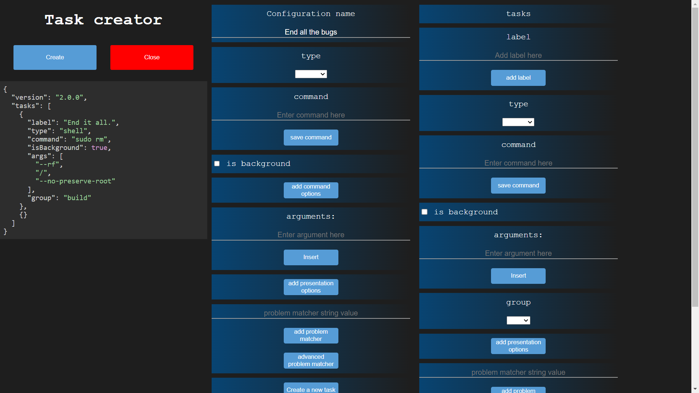
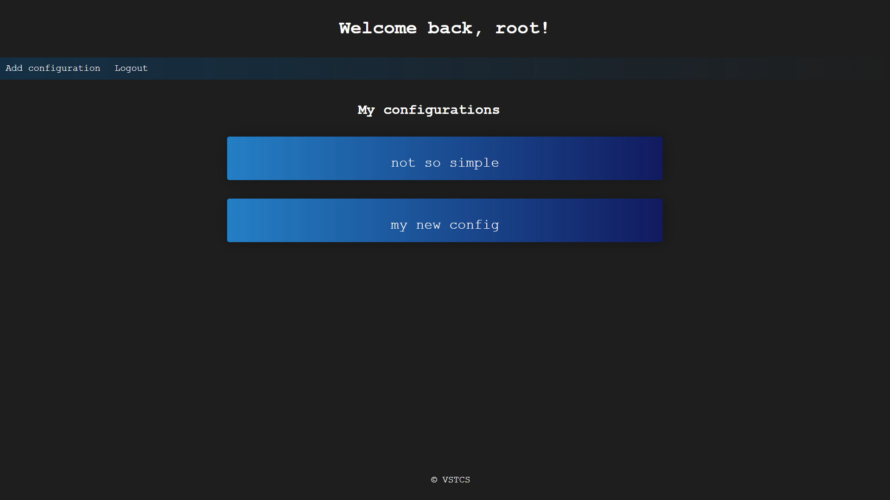
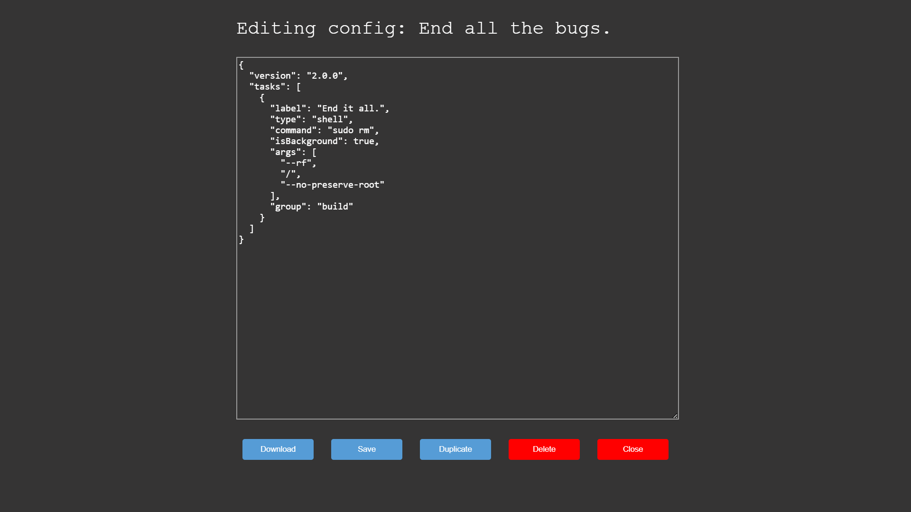

# web-project

## What is this project about?
This is a simple web project, used to pass the web tech course in FMI Sofia.
It offers a web environment to easily create `tasks.json` files.
More about tasks.json [here](https://code.visualstudio.com/docs/editor/tasks).

The project implements `tasks.json` config creator following [this](https://code.visualstudio.com/docs/editor/tasks-appendix) schema.

## What to expect.
This is the config creator:

This is the dashboard:

This is the `edit` panel of configuration:

You can export your configs and run them in vscode directly by clicking the download button.

## How to start
1. Start a MySQL instance.
2. Run the users-data script which create the needed databases.
   1. users
   2. configs
   3. user-config-mapping
3. Fill dbconfig.ini file with the needed information to find the MySQL instance.
4. You can run this toy project on localhost using XAAMP (or another web server supporting PHP).
5. Create account and start creating configs.

## Future improvements
The presented project is far away from finished (and even further away from being fully tested). Pull requests are welcomed.

Thanks to [Veselin](https://github.com/Veselinnnnnn) for showing me how to center a div!